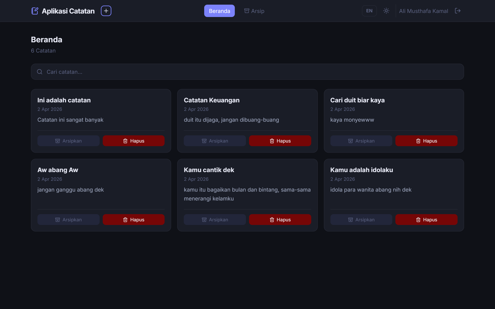

# Personal Notes App

Personal notes app is a website application to manage notes everyone on the whole of world.

---

## Struktur Folder

src/
├── App.jsx # Routing + Protected/Guest routes
├── main.jsx # Entry point + semua Context providers
├── style.css # CSS variables (dark/light theme)
│
├── contexts/
│ ├── AuthContext.jsx # State user login, onLoginSuccess, onLogout
│ ├── ThemeContext.jsx # Toggle tema + persist ke localStorage
│ └── LanguageContext.jsx # Toggle bahasa ID/EN + persist localStorage
│
├── hooks/
│ └── useInput.js # useInput() dan useNotes() custom hooks
│
├── services/
│ └── network-data.js # Semua fungsi fetch API (login, register, CRUD notes)
│
├── components/
│ ├── Navbar.jsx # Navbar global: nav links, theme/lang toggle, logout
│ ├── NoteCard.jsx # Card catatan dengan tombol archive/delete
│ ├── NotesList.jsx # Grid list catatan
│ ├── SearchBar.jsx # Input pencarian
│ └── LoadingSpinner.jsx # Indikator loading (fullscreen atau inline)
│
└── pages/
├── LoginPage.jsx # Halaman login dengan useInput hook
├── RegisterPage.jsx # Halaman register dengan validasi & useInput hook
├── HomePage.jsx # Daftar catatan aktif
├── ArchivePage.jsx # Daftar catatan terarsip
├── AddNotePage.jsx # Form tambah catatan baru
├── NoteDetailPage.jsx # Detail catatan + archive/delete
└── NotFoundPage.jsx # Halaman 404

---

## Fitur yang Diimplementasikan

### Kriteria Utama

1. ✅ **RESTful API** — semua data dari `https://notes-api.dicoding.dev/v1`
2. ✅ **Registrasi & Autentikasi** — Login/Register pages, token disimpan di localStorage
3. ✅ **Protected Routes** — halaman catatan hanya bisa diakses setelah login
4. ✅ **Ubah Tema** — dark/light mode via ThemeContext + persisten di localStorage
5. ✅ **Custom Hooks** — `useInput()` untuk controlled inputs, `useNotes()` untuk data fetching
6. ✅ **Semua fitur sebelumnya** — CRUD catatan, arsip, detail, pencarian

### Kriteria Opsional

- ✅ **Loading indicator** — `<LoadingSpinner />` saat fetch data
- ✅ **Ubah Bahasa** — toggle ID/EN via LanguageContext + persisten di localStorage

## Cara Pakai

1. Install dependencies:

   ```bash
   npm install
   ```

2. Jalankan dev server:

   ```bash
   npm run dev
   ```

3. Daftar akun baru di `/register`, lalu login di `/login`.

---

## 📷 Dokumentasi Produk

### Desktop View Ver.1

<p align="center">

</p>

### Desktop View Ver.2

<p align="center">

</p>

---
